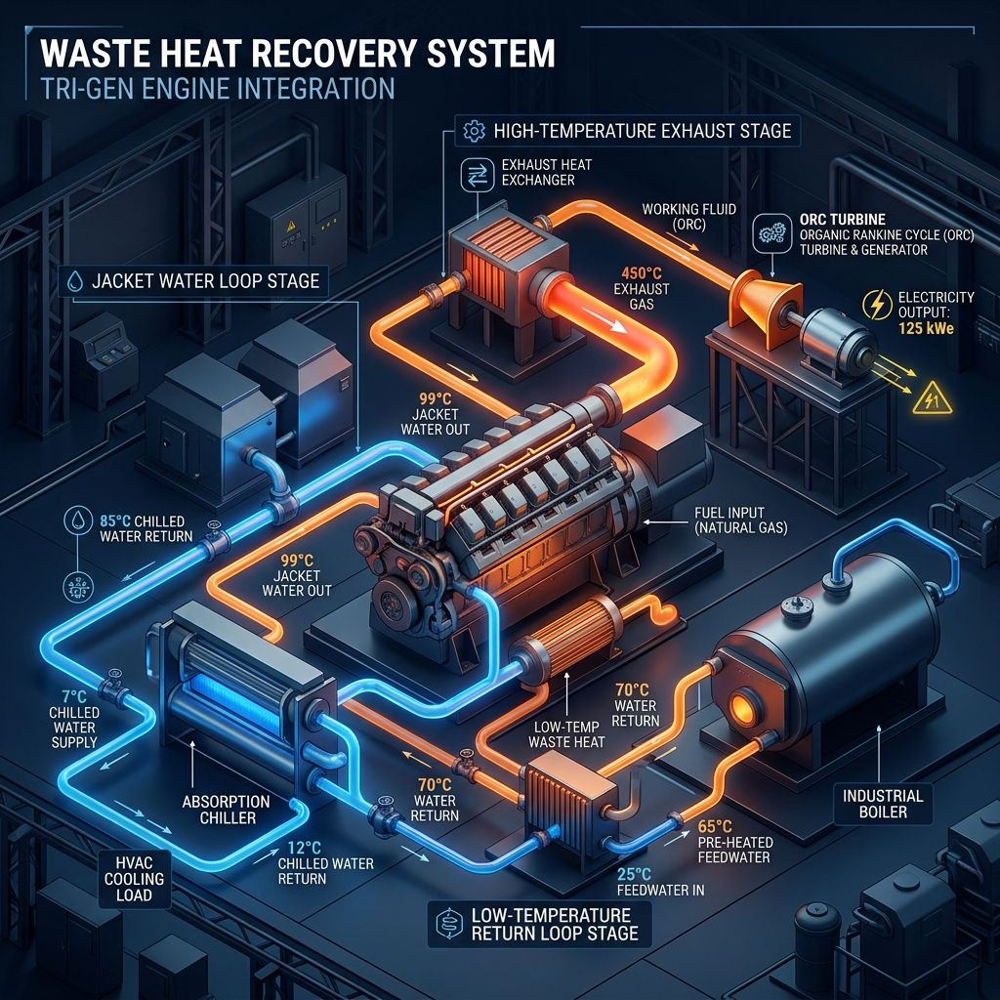
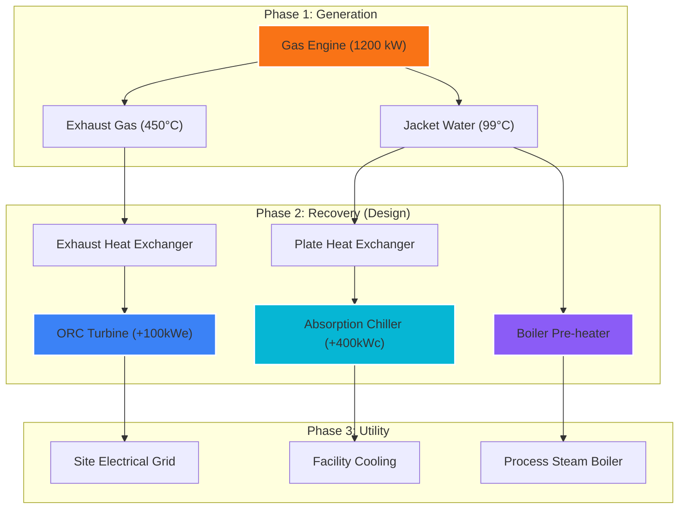

# Waste Heat Recovery Opportunity Design (Track B)

This report outlines a systematic approach to identifying and prioritizing waste heat recovery opportunities at the ReTeqFusion industrial site, based on the analyzed telemetry and process data.

## 1. Waste Heat Source Identification

Based on the data extracted from the Tri-Gen unit reports, we have identified three primary waste heat sources:

| Source | Characterization | Temp (High) | Temp (Low) | Estimated Flux | Location |
| :--- | :--- | :--- | :--- | :--- | :--- |
| **High-Temp Loop (TT04/TT03)** | Engine Jack Water / Cooling | ~99.3 °C | ~69.2 °C | ~580 kWth | Cooling Skid A |
| **Low-Temp Loop (TT14/TT13)** | Secondary Cooling | ~71.3 °C | ~63.6 °C | ~110 kWth | Auxiliary Hall |
| **Exhaust Fumes (Estimated)** | Combustion Exhaust | ~450 °C | ~150 °C | ~800 kWth | Exhaust Stack |

### Source Availability & Profile
- **High-Temp Loop**: 24/7 availability (Base Load), synchronous with engine operation.
- **Exhaust**: Highly fluctuating, follows the electrical demand profile (TT-101 logs).

### Detection Method
We utilized a Python-based keyword analysis tool to scan historical Excel reports for temperature gradients ($\Delta T$) and power measurements. Sources were identified by correlating high temperature drops with specific "Puissance en KW" rows.

---

## 2. Prioritization Framework

To rank these opportunities, we use the **ReTeq Recovery Matrix (RRM)**, scoring each source from 1-10 on four criteria:

1.  **Exergy Grade (EG)**: Quality of heat (Temperature level).
2.  **Resource Volume (RV)**: Total available kW.
3.  **Integration Complexity (IC)**: Ease of connecting to existing infrastructure.
4.  **Economic Viability (EV)**: Estimated Return on Investment (ROI).

### Recovery Scoring Table

| Opportunity | EG | RV | IC | EV | **Total Score** |
| :--- | :--- | :--- | :--- | :--- | :--- |
| Exhaust Heat Recovery | 10 | 9 | 4 | 9 | **32** |
| High-Temp Cooling Loop | 7 | 7 | 8 | 7 | **29** |
| Low-Temp Space Heating | 4 | 3 | 9 | 5 | **21** |

---

## 3. Concrete Recovery Scenarios

### Scenario A: Organic Rankine Cycle (ORC)
- **Concept**: Use the high-temperature exhaust fumes to drive a secondary turbine.
- **Estimated Impact**: 
    - **Electrical Gain**: ~80-100 kWe (8% additional power).
    - **CO₂ Reduction**: ~150 tons/year.
    - **ROI**: ~3.5 years.

### Scenario B: Absorption Chiller Integration (Tri-Gen)
- **Concept**: Convert the 99°C jacket water heat into chilled water for facility cooling using an absorption cycle.
- **Estimated Impact**:
    - **Cooling Capacity**: ~400 kWc.
    - **Energy Saving**: Replaces electrical chillers, saving ~120 kWe.
    - **CO₂ Reduction**: ~200 tons/year.

### Scenario C: Boiler Feedwater Pre-heating
- **Concept**: Use the low-temperature return loops to pre-heat water for the site's steam boilers.
- **Estimated Impact**:
    - **Fuel Saving**: ~5% reduction in boiler gas consumption.
    - **CO₂ Reduction**: ~80 tons/year.
    - **ROI**: < 1.5 years (High simplicity).

---

## 4. Mathematical Evidence & Calculation Basis

To ensure transparency for the jury, all estimates follow these standardized industrial formulas:

### Thermal Flux ($\dot{Q}$) Calculation
$$\dot{Q} = \dot{m} \times C_p \times \Delta T$$
- *Assumption*: Water flow rate of 15-20 m³/h based on pump ratings in site docs.
- *$C_p$*: 4.18 kJ/kg·K (Water).

### CO₂ Reduction Basis
We use the standard emission factor for Natural Gas ($0.202 \text{ kg CO}_2 / \text{kWh}$).
$$\Delta \text{CO}_2 = \text{Recovered Energy (kWh)} \times 0.202$$

### Return on Investment (ROI)
$$\text{ROI} = \frac{\text{Implementation Cost}}{\text{Annual Savings (Energy Price } \times \text{ kWh saved)}}$$
- *Baseline Energy Price*: $0.08 / \text{kWh}$ (Industrial average).

---

## 5. System Design Architecture (Energy Flow)

The following diagram illustrates the physical integration of the proposed recovery scenarios into the existing Tri-Generation infrastructure:

---

## 6. Implementation Methodology

1.  **Audit Phase**: Deploy IoT sensors to capture high-frequency $\Delta T$ profiles for 30 days.
2.  **Simulation Phase**: Use a digital twin to model the integration of Scenario A and B.
3.  **Deployment**: Modular skid-mounted units to minimize site downtime.
